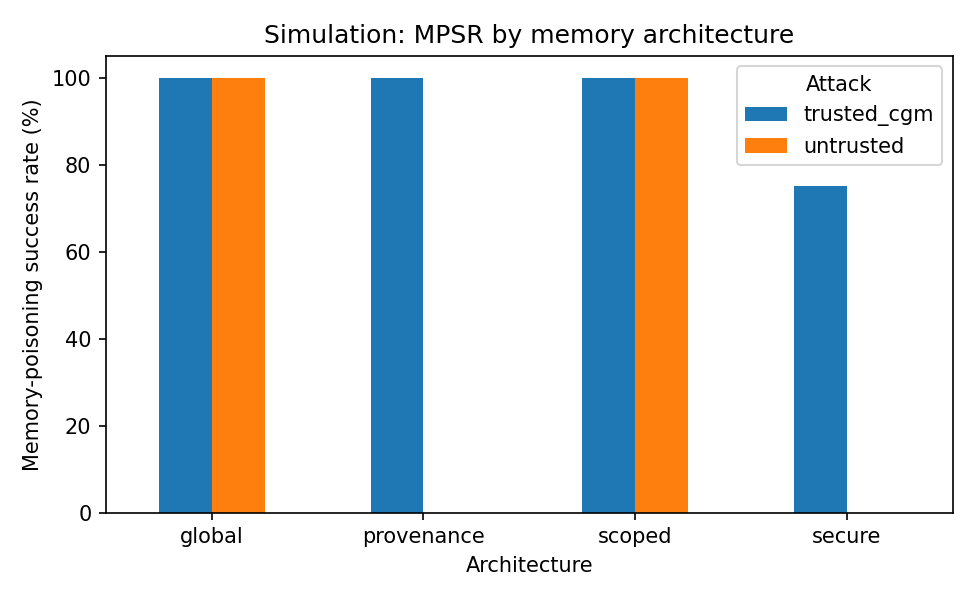
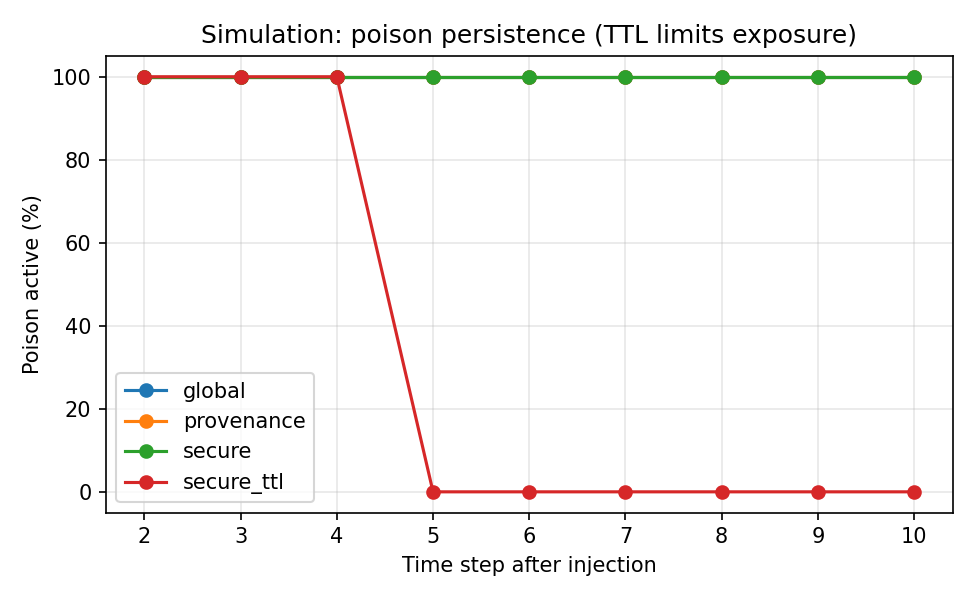
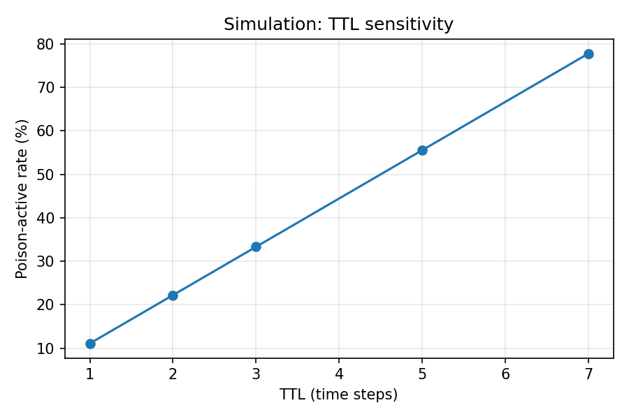
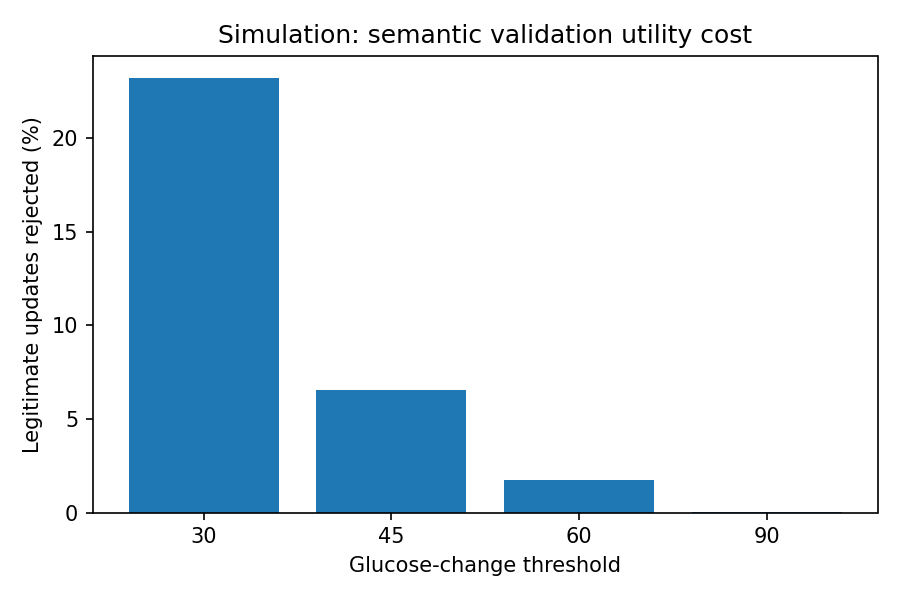
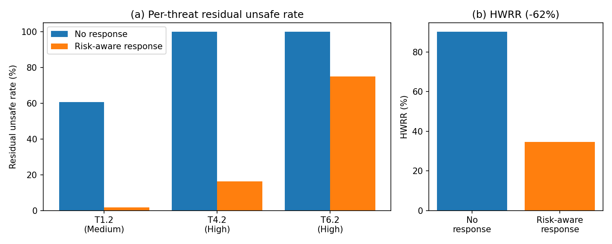

# MedSTRIDE-AI: Extended STRIDE Threat Modeling for Multimodal Agentic AI in Medical IoT

Code, data and simulations accompanying the paper **"MedSTRIDE-AI: An Extended STRIDE-Based Threat Modeling Framework for Multimodal Agentic AI Systems in Medical Internet of Things (MIoT) Environments"**, *Computers* (MDPI), 2026.

**Authors:** Syed Usman Jamil (Edith Cowan University, Australia), Md. Abdur Rahman (University of Prince Mugrin, KSA), Ravi Thapa (Melbourne Institute of Technology, Australia), Rabia Khan (Kohat University of Science & Technology, Pakistan), Leslie F. Sikos (Edith Cowan University, Australia), Nadia Jamil (Immigration & Passport, Islamabad, Pakistan), Selwa A. F. Al-Hazzaa (KACST, KSA)

**Correspondence:** s.jamil@ecu.edu.au

---

## Introduction

Multimodal agentic AI in MIoT creates compound threats (intrusion, zero-day anomalies) that classic STRIDE does not capture. MedSTRIDE-AI keeps the six STRIDE categories as a foundation, adds three propagation-oriented threat extensions, an ISO 14971:2019-inspired patient-harm prioritisation layer, and a six-step threat identification workflow.

## Contributions

1. Three structural threat extensions: **T1.2** Multimodal Adversarial Fusion Attacks, **T4.2** Unsafe Autonomous Clinical Action Chains, **T6.2** Cross-Device Cascading Memory Poisoning.
2. A Low / Medium / High patient-harm prioritisation layer inspired by ISO 14971:2019 (for triage only, not a full medical-device risk process).
3. A six-step workflow: system decomposition, modality identification, agent mapping, threat classification, harm scoring, prioritisation.
4. A risk-aware IDS response that scales containment to harm tier, reducing harm-weighted residual risk (HWRR) by about **62%** versus a harm-agnostic response.
5. Three mechanism-level experiments (WESAD, MIT-BIH, 5,000-episode shared-memory simulation).

## Threat Taxonomy

| ID | Name | STRIDE parent | ISO 14971 harm |
|---|---|---|---|
| T1.2 | Multimodal Adversarial Fusion Attacks | Tampering / Information Disclosure | Medium (escalates to High without independent review) |
| T4.2 | Unsafe Autonomous Clinical Action Chains | Elevation of Privilege / Tampering | High |
| T6.2 | Cross-Device Cascading Memory Poisoning | Tampering / Spoofing | High |

## Key Results

**T1.2 (WESAD, 15 subjects, subject-independent split)**: clean AUROC 0.960 / 0.967 / 0.940 (early / late / reliability-aware fusion). At eps = 1.0, late-fusion targeted ASR is 60.66% (ACC), 29.51% (ECG), 1.64% (BVP). Oracle isolation of ACC drops ASR to 1.64% and restores AUROC 0.6196 to 0.9490. Isolation of ECG under weak attack hurts (security-utility trade-off).

**T4.2 (MIT-BIH ECG detector)**: clean AUROC 0.8575. Targeted PGD at eps = 0.02 suppresses 31.98% (339 of 1060) of correctly detected abnormal beats. An independent safety agent intercepts 83.78%, leaving 16.22% residual unsafe.

**T6.2 (5,000-episode shared-memory testbed)**

| Architecture | Untrusted writer (MPSR) | Trusted-source compromise (MPSR) |
|---|---|---|
| Global | 1.00 | 1.00 |
| Provenance | 0.00 | 1.00 |
| Scoped | 1.00 | 1.00 |
| Secure (combined) | 0.00 | 0.75 |

TTL limits poison persistence; semantic thresholds of 30 / 45 / 60 / 90 reject 23.24% / 6.54% / 1.72% / 0.02% of legitimate updates.

**Risk-aware IDS response (HWRR)**: 0.9017 (no response) to 0.3462 (risk-aware), about 62% reduction. `HWRR = sum(w_i * r_i) / sum(w_i)`, weights Medium = 2, High = 3.

## Repository Structure

```
notebooks/
  Part1.ipynb            T4.2  ECG classification, adversarial perturbation, agent cascade (MIT-BIH)
  part2.ipynb            T6.2  shared-memory poisoning, provenance/scope/TTL/semantic controls
  part3.ipynb            T1.2  multimodal stress classification and modality attacks (WESAD)
run_memory_simulation.py Standalone CPU run of the T6.2 simulation (part2.ipynb)
hwrr_risk_aware_ids.py   Reproduces Eq. (1) / Table 18 / Figure 12
plot_paper_figures.py    Re-plots key paper results from paper_data/
plot_simulation_results.py Plots the T6.2 simulation outputs
paper_data/              Key tables from the paper as CSV (taxonomy, workflow, T1.2, T4.2, T6.2)
results/                 Generated figures, HWRR table and memory-simulation outputs
```

## How to Run

```sh
python -m pip install -r requirements-simulation.txt

# T6.2 shared-memory simulation (seed 42, 5,000 synthetic episodes, CPU only)
python run_memory_simulation.py --output-dir results/memory-simulation

# Risk-aware IDS response (HWRR)
python hwrr_risk_aware_ids.py

# Paper figures from paper_data/
python plot_paper_figures.py

# Plots of the simulation outputs
python plot_simulation_results.py
```

Parts 1 and 3 download MIT-BIH and WESAD, use Colab-style `/content/` paths and shell commands, and are best run on a GPU runtime (`pip install -r requirements.txt`, then adapt paths). Part 3 loads WESAD pickle files; only use the trusted dataset source.

## Verification

The T6.2 simulation was executed end to end (47 code cells, seed 42, 5,000 episodes). Its output matches the paper's Table 17 (MPSR / reach / unsafe actions), the TTL sensitivity values (0.111 to 0.778) and the semantic-threshold rejection rates. `hwrr_risk_aware_ids.py` reproduces HWRR 0.9017 and 0.3462.

## Simulation Results (T6.2 Shared-Memory Testbed)

Generated by `run_memory_simulation.py` (seed 42, 5,000 synthetic episodes: CGM, insulin, diet, alert and EHR agents on shared memory). Plots are produced by `plot_simulation_results.py`.

| Architecture | Attack | MPSR | Propagation reach | EHR reach | Mean unsafe actions |
|---|---|---|---|---|---|
| Global | Untrusted | 1.00 | 1.00 | 1.00 | 3.0 |
| Provenance | Untrusted | 0.00 | 0.00 | 0.00 | 0.0 |
| Scoped | Untrusted | 1.00 | 1.00 | 1.00 | 3.0 |
| Secure | Untrusted | 0.00 | 0.00 | 0.00 | 0.0 |
| Global | Trusted-source | 1.00 | 1.00 | 1.00 | 3.0 |
| Provenance | Trusted-source | 1.00 | 1.00 | 1.00 | 3.0 |
| Scoped | Trusted-source | 1.00 | 1.00 | 1.00 | 3.0 |
| Secure | Trusted-source | 0.75 | 0.75 | 1.00 | 2.0 |

<p align="center">
  
  
</p>
<p align="center">
  
  
</p>

| TTL (steps) | 1 | 2 | 3 | 5 | 7 |
|---|---|---|---|---|---|
| Poison-active rate | 0.111 | 0.222 | 0.333 | 0.556 | 0.778 |

| Semantic threshold | 30 | 45 | 60 | 90 |
|---|---|---|---|---|
| Legitimate updates rejected | 23.24% | 6.54% | 1.72% | 0.02% |

**Risk-aware IDS response (HWRR, Table 18 / Figure 12)**

<p align="center"></p>

Raw CSV outputs are in `results/memory-simulation/`; paper-figure re-plots (T1.2, T4.2, T6.2) are in `results/`.

## Limitations

- T1.2 attacks are feature-space stress tests, not physically realizable raw-signal attacks; isolation uses an oracle, not a deployable detector.
- T4.2 downstream cascade and safety agent are controlled abstractions, not a deployed medication system.
- T6.2 is a synthetic simulation with programmatic rules and simulated trust flags/hashes, not a production MIoT network.
- Part 1 contains a literal `clean_results` dictionary of historical metrics; Parts 1 and 3 were not retrained when preparing this repository.
- Harm tiers and regulatory mappings (HIPAA, TGA SaMD, IEC 62443) are conceptual aids, not compliance certification or clinical validation.

## Citation

```
S. U. Jamil, M. A. Rahman, R. Thapa, R. Khan, L. F. Sikos, N. Jamil, S. A. F. Al-Hazzaa.
"MedSTRIDE-AI: An Extended STRIDE-Based Threat Modeling Framework for Multimodal
Agentic AI Systems in Medical Internet of Things (MIoT) Environments." Computers, MDPI, 2026.
```
